## 数据库

## 数据库基本概念

### 数据库

DataBase(数据库)，存储数据的仓库。

之前我们项目中将用户信息写入一个文件，最终用一个目录users保存所有用户信息。这个users目录就可以称为

是一个数据库。利用文件系统进行操作，经常已手动或半自动形式维护数据的操作，缺点:低效。


###  数据库管理系统

DBMS(数据库管理系统)。可独立运行的软件，用于维护数据的操作。

常见的DBMS有:

- mysql
- oracle
- db2
- sqlserver

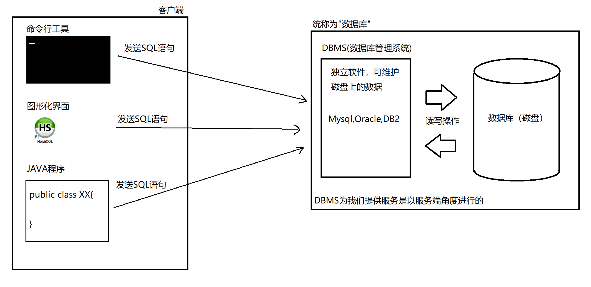


### 数据库与表的概念

以Mysql为例:

我们可以在Mysql中创建若干个数据库，每个数据库用于一个项目。

每个数据库中又可以创建多个表，表是用于保存一组数据的。

示意图:

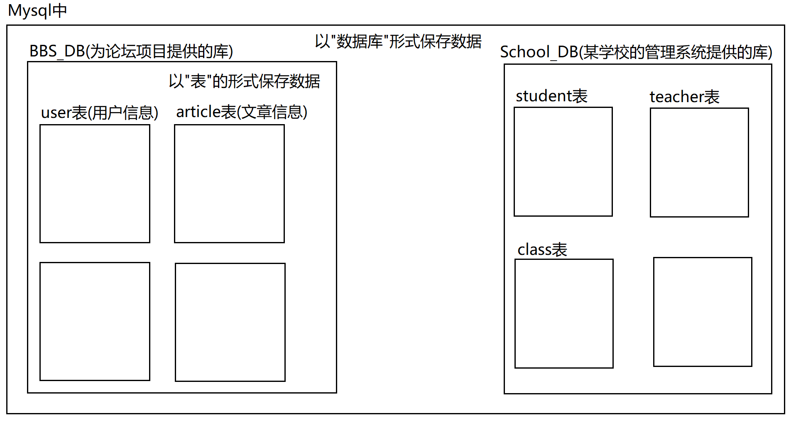

数据表是由行和列构成

其中列被称为字段，就是一组数据中各部分信息。

其中行被称为记录，就是各部分信息组成的一条数据。

注:用面向对象的角度思考:

​	 表相当于是一个java类。比如User类

​	 字段相当于是类中的属性。比如User类中有username,password,nickname,age四个属性

​	 记录相当于是类的一个实例。比如一个User实例就可以表示一个用户信息

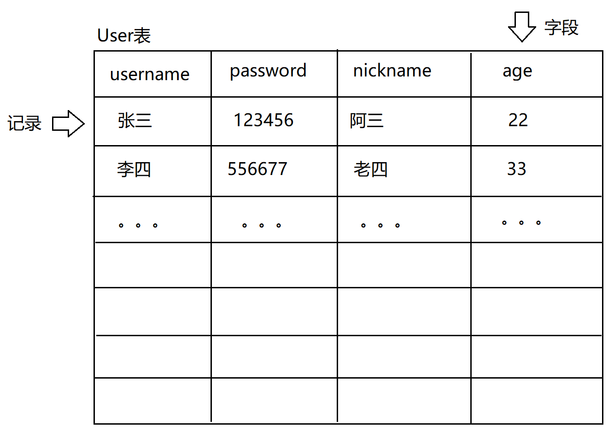


### 如何操作DBMS

所有的DBMS都支持通过SQL语句进行操作。我们向数据库发送特定的SQL语句来表达要进行某项操作。

SQL有标准：SQL92

所有的DBMS都支持SQL92标准。

注:Structured Query Language（SQL）结构化查询语言


## 连接数据库的方式

1. 命令行形式
2. 第一方或第三方提供的图形化界面的客户端
3. 在集成开发环境中(IDEA,Eclipse)
4. JDBC(java 数据库连接)，java程序中若需要使用数据库则这样连接(IDEA,Eclipse都采取这种方式)


## SQL语句分类

- DDL	数据定义语言

  ​			CREATE,DROP,ALTER

  ​			对数据库对象进行操作的语言。数据库对象有:数据库，表，视图，索引等。

- DML    数据操作语言

  ​			INSERT,UPDATE,DELETE

  ​			对表中的数据进行操作的语言。

- DQL    数据查询语言

  ​			SELECT

  ​			对表中的数据进行查询的语言。

- DCL     数据控制语言

  ​			DBA用于管理数据库的语言。

- TCL     事物控制语言

  ​			COMMIT,ROLLBACK

  ​			对DML数据操作保证具有原子性，一致性。


### DDL	数据定义语言

#### 查看DBMS中已有的数据库

```sql
SHOW DATABASES
```


#### 数据库相关操作

##### 新建一个数据库

基本语法:

```sql
CREATE DATABASE 数据库名 [CHARSET=字符集名称]
```

例如:

```sql
新建一个名为mydb的数据库
CREATE DATABASE mydb
```

创建数据库时可以指定字符集

```SQL
CREATE DATABASE mydb1 CHARSET=UTF8
CREATE DATABASE mydb2 CHARSET=GBK
```


##### 查看数据库信息

```sql
SHOW CREATE DATABASE 数据库名
```

例:

```sql
SHOW CREATE DATABASE mydb1
```


##### 删除数据库

```sql
DROP DATABASE 数据库名
```

例:

```sql
DROP DATABASE mydb1
```


##### 使用一个数据库(切换一个数据库)

若希望保存数据，则数据必须保存在某张表上。而表必须保存在某个数据库上，因此后期为了对某个数据库的表进行操作，要先切换到该数据库上，才能进行操作。

```sql
USE 数据库名
```

例:切换到mydb数据库

```sql
USE mydb
```


##### 练习:

```sql
1. 创建 mydb1和mydb2 数据库 字符集分别为utf8和gbk
   CREATE DATABASE mydb1 CHARSET=utf8
   CREATE DATABASE mydb2 CHARSET=gbk
2. 查询所有数据库检查是否创建成功
   SHOW DATABASES
3. 检查两个数据库的字符集是否正确
   SHOW CREATE DATABASE mydb1
   SHOW CREATE DATABASE mydb2
4. 先使用mydb2 再使用 mydb1
   USE mydb2
   USE mydb1
5. 删除两个数据库
   DROP DATABASE mydb1
   DROP DATABASE mydb2
```


#### 表相关操作

##### 创建表

语法:

```SQL
CREATE TABLE 表名(
                 字段名 类型,
                 字段名 类型,
  ...
)
```

例:

```SQL
CREATE TABLE user(
                   id INT,							INT在mysql中为整数类型。
    username VARCHAR(30),			VARCHAR在mysql中为字符串类型，长度为字节，
                     password VARCHAR(30),			VARCHAR(30)则字符转换的字节最多30个，
                     nickname VARCHAR(30),			若UTF-8编码则中文最多10个字(每个中文3字节)。
                     age INT(3)						INT指定长度为位数。这里INT(3)为最多3位整数。
)
```

##### 查看已创建的表的表结构

语法:

```sql
DESC 表名
```

例:

```sql
查看user表的表结构
DESC user
```


##### 查看已创建表的详细信息

```sql
SHOW CREATE TABLE 表名
```

例如:

```sql
SHOW CREATE TABLE user
```


##### 删除表

语法:

```sql
DROP TABLE 表名
```

例:

```sql
删除user表
DROP TABLE user
```


##### 查看数据库中所有的表

```sql
SHOW TABLES
```


##### 修改表

- 修改表名

  语法:

  ```sql
  RENAME TABLE 原表名 TO 新表名
  ```

  例如:

  ```sql
  将表user改名为userinfo
  RENAME TABLE user TO userinfo
  ```


- 修改表结构

  ```sql
  准备一张表测试:
  CREATE TABLE hero(
    	name VARCHAR(30),
      age INT(3)
  ) 
  ```

  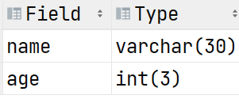

  - 添加字段

    - 向表末尾追加新的字段

      ```sql
      ALTER TABLE 表名 ADD 字段名 类型
      ```

      例:

      ```sql
      ALTER TABLE hero ADD gender VARCHAR(10)
      ```

      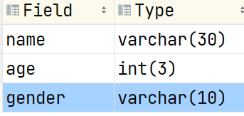

    - 将字段添加到表的第一个字段位置上

      ```sql
      ALTER TABLE 表名 ADD 字段名 类型 FIRST
      ```

      例:

      ```sql
      在hero表第一个字段上添加id
      ALTER TABLE hero ADD id INT FIRST
      ```

      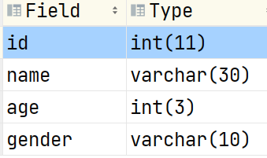

    - 将字段插入到表中某个位置

      ```sql
      将字段插入到表中某字段的后面
      ALTER TABLE 表名 ADD 字段名 类型 AFTER 表中某字段
      ```

      例：

      ```sql
      将密码(pwd)字段插入到name和age之间
      ALTER TABLE hero ADD pwd VARCHAR(30) AFTER name
      ```

      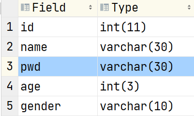

  - 删除字段

    ```sql
    ALTER TABLE 表名 DROP 字段名
    ```

    例:

    ```sql
    将pwd字段从hero表中删除
    ALTER TABLE hero DROP pwd
    ```


- 修改现有字段

  ```sql
  ALTER TABLE 表名 CHANGE 原字段名 新字段名 类型
  ```

  例:

  - ```SQL
      将hero表中age字段的长度改为5
      ALTER TABLE hero CHANGE age age INT(5)
      ```

    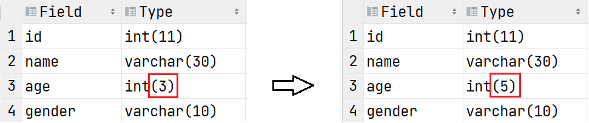


    - ```sql
      将hero表中age字段的类型改为VARCHAR(10)
      ALTER TABLE hero CHANGE age age VHARCHAR(10)
      ```
    
      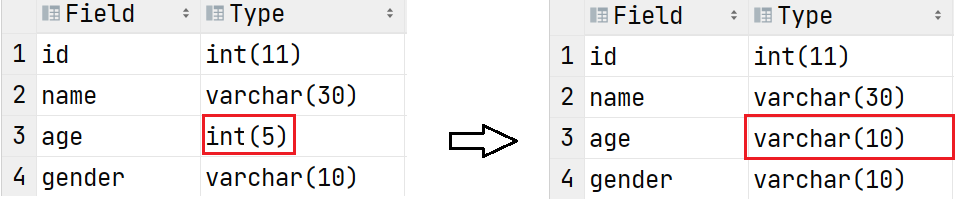


​      

    - ```sql
      将hero表中gender字段名改为pwd
      ALTER TABLE hero CHANGE gender pwd VARCHAR(10)
      ```
    
      
    
    - 注意事项:
    
      修改表字段应当在表中没有数据时进行。如果表中已经存在数据，则修改字段可能不成功。
    
      比如:
    
      hero表中有10条记录，每条记录gender字段已经有值(每个人的性别)
    
      若此时将表字段gender修改类型为INT。此时字符串转换int("男"怎么转成整数???)


​      

      比如:
    
      hero表中pwd记录了每个人的密码。原长度为10。此时若修改字段长度为5，会导致原密码保存不下则修改失败。


##### 练习:

```sql
1.创建数据库mydb3 字符集gbk 并使用
  CREATE DATABASE mydb3 CHARSET=gbk
  USE mydb3
2.创建t_hero英雄表, 有名字和年龄字段
  CREATE TABLE t_hero(
  	name VARCHAR(30),
    age INT(3)
  ) 
3.修改表名为hero
  RENAME TABLE t_hero TO hero
4.查看表hero的信息
  SHOW CREATE TABLE hero
5.查询表hero结构
  DESC hero
6.删除表hero
  DROP TABLE hero
7.删除数据库mydb3
  DROP DATABASE mydb3
```

#### 作业:

```sql
1.创建数据库mydb4 字符集utf8并使用
2.创建teacher表 有名字(name)字段
3.添加表字段: 最后添加age 最前面添加id(int型) , age前面添加salary工资(int型)
4.删除age字段
5.修改表名为t
6.删除表t
7.删除数据库mydb4
```


### DML 数据操作语言

DML:对表中数据进行操作的语言，涵盖的内容为:INSERT(增),DELETE(删),UPDATE(改)

准备一张表:

```sql
CREATE TABLE person(
                     name VARCHAR(30),
                     age INT(3)
)
```


#### 插入数据(INSERT)

##### 语法:

```sql
INSERT INTO 表名[(字段1,字段2,...)] VALUES(字段的1值,字段2的值,...)
```

注:在语法定义上"[]"中的内容表示可写可不写

##### 例

```sql
INSERT INTO person(name,age) VALUES('张三',25)
  INSERT INTO person(age,name) VALUES(33,'李四')
```

注:

- **数据库中字符串的字面量是使用单引号''表达的**

- **VALUES中指定的值要与指定的字段名个数,顺序,以及类型完全一致**

- **查看表中数据**

  ```
  SELECT * FROM person
  ```

##### 

##### 插入默认值

当插入数据时不指定某个字段，那么该字段插入默认值。若创建表时字段没有显示的指定默认值时，默认值插入NULL

例:

```sql
INSERT INTO person (name) VALUES ('王五')
```


注:

- age字段没有指定，因此插入默认值NULL

- 数据库中任何字段任何类型默认值都是NULL，当然可以在创建表时使用DEFAULT指定。

  ```SQL
  修改person表中age的默认值为20
  ALTER TABLE person CHANGE age age INT(3) DEFAULT 20
  
  修改后向person表中插入数据
  INSERT INTO person (name) VALUES ('赵六')
  
  
  提示:也可在创建person表时为字段指定默认值
  CREATE TABLE person(
  	name VARCHAR(30) DEFAULT '无名氏',
      age INT(3) DEFAULT 20
  )
  ```

  为age添加默认值20:

  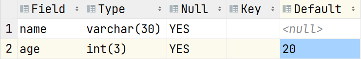

  插入'赵六'

  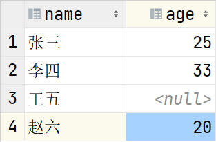


##### 全列插入

当我们插入数据是不指定任何字段名时，就是全列插入。此时VALUES子句中需要为每个字段指定值。并且要求(个数，顺序，类型必须与表完全一致)

例:

```sql
INSERT INTO person VALUES('钱七',21);

若某个字段有默认值，可以用DEFAULT表示默认值
INSERT INTO person VALUES('钱七',DEFAULT);

若某个字段想插入NULL值，可以使用NULL表达
INSERT INTO person VALUES('钱七',NULL);

下列为错误示例
INSERT INTO person VALUES('钱七');		列的值个数不匹配
INSERT INTO person VALUES(27,'钱七');		列的值类型不匹配

```


#### 修改数据(UPDATE)

##### 语法

```sql
UPDATE 表名 SET 字段1=新值1[,字段2=新值2,...][WHERE 过滤条件]
```

例

```sql
UPDATE person SET age=15
  上述SQL执行后会导致person表中所有记录的age字段值都被改为15
```

**UPDATE语句通常都要添加WHERE子句，用于添加要修改记录的条件，否则全表修改！**


##### 修改指定记录(添加WHERE子句)

例

```sql
将张三的年龄改成20岁
UPDATE person
SET age=20
WHERE name='张三'		仅将person表中某条记录name字段值为‘张三’的age改为20

将person表中年龄为16岁的人改为36岁
UPDATE person
Set age=36
WHERE age=16		  person表中凡是满足WHERE条件的记录都会被修改
```


##### WHERE子句中常用的条件

**=, <, <= ,> ,>= ,<>(不等于使用<>。!=不是所有数据库都支持)**

```sql
将person表中年龄大于30岁的人改为年龄29
UPDATE person
SET age=29
WHERE age>30
```


##### 将一个计算表达式的结果作为值使用

```sql
将person表中每个人的年龄涨1岁
UPDATE person
SET age=age+1			将每条记录年龄的值+1后再修改回年龄字段
```


##### 同时修改多个字段

```sql
将'李四'改为'李老四'且年龄改为55岁
UPDATE person
SET name='李老四',age=55
WHERE name='李四'
```


#### 删除语句(DELETE)

##### 语法:

```sql
DELETE FROM 表名 [WHERE 过滤条件]
```

**注:DELETE语句通常都要添加WHERE子句，否则是清空表操作**

例:

```sql
删除'李老四'
DELETE FROM person
WHERE name='李老四'	仅删除person表中满足WHERE条件的记录


删除年龄大于等于30岁的人
DELETE FROM person
WHERE age>=30

```

##### 清空表操作

```sql
DELETE FROM person
```


#### 练习:

```sql
1.创建数据库day1db 字符集utf8并使用
  CREATE DATABASE day1db CHARSET=utf8
  USE day1db
2.创建t_hero表, 有name字段,字符集utf8
CREATE TABLE t_hero(
  name VARCHAR(30)
)CHARSET=utf8
3.修改表名为hero
  RENAME TABLE t_hero TO hero
4.最后面添加价格字段money, 最前面添加id字段, name后面添加age字段
ALTER TABLE hero ADD money INT
ALTER TABLE hero ADD id INT FIRST
ALTER TABLE hero ADD age INT AFTER name
  
5.表中添加以下数据: 1,李白,50,6888 2,赵云,30,13888 3,刘备,25,6888
  INSERT INTO hero(id,name,age,money) VALUES(1,'李白',50,6888)
  INSERT INTO hero(id,name,age,money) VALUES(2,'赵云',30,13888)
  INSERT INTO hero(id,name,age,money) VALUES(3,'刘备',25,6888)
6.修改刘备年龄为52岁
UPDATE hero
SET age=52
WHERE name='刘备'
  7.修改年龄小于等于50岁的价格为5000
UPDATE hero
SET money=5000
WHERE age<=50
  8.删除价格为5000的信息
DELETE FROM hero
WHERE money=5000
  9.删除表, 删除数据库
DROP TABLE hero
DROP DATABASE day1db

```


#### 总结

- DML:数据操作语言，它是对表中数据进行操作的语言，涵盖操作:增(INSERT)，删(DELETE)，改(UPDATE)

- INSERT语句用于将数据插入表中

  - INSERT时指定的字段顺序可以与表不一致，但是VALUES子句中值的顺序要与指定顺序一致

  - INSERT时可以不指定某字段，那么此时该条记录该字段会插入默认值

  - INSERT时为某个字段插入其指定的默认值，使用关键字DEFAULT。

    字段若指定了默认值则使用该默认值，否则字段默认值为NULL。

  - INSERT时使用NULL插入一个字段为null值。

  - INSERT时可以不指定字段名，那么为全列插入，此时VALUES子句指定的值顺序，个数，类型必须与表结构完全一致。

- UPDATE语句用于修改表中数据

- DELETE语句用于删除表中数据

- UPDATE语句和DELETE语句通常都要添加WHERE子句，否则是对全表所有记录操作。


### 数据库常用的数据类型

不同的数据库数据类型不完全一致

#### 数字类型

##### 整数类型:INT(m)和BIGINT(m)

- m:整数的位数
- int(5):最大保存一个5位整数。
  - 若保存的数字为18，实际存的时候前面会补0:00018

##### 浮点类型:DOUBLE(m,n)

- m:数字的位数

- n:小数部分的位数

- m包含n

  - DOUBLE(5,3):该数字总共5位，其中有3位小数(意味着整数位2位)。

    最大个保存的数字为:99.999

  - 当保存的数字精度超过可保存精度时，会进行4舍5入

    ```
    例如person表中salary字段的类型:DOUBLE(7,4)
    
    INSERT INTO person (salary) VALUES(553.12568)
    实际salary保存的数字为:553.1257
    ```

    

  - 当最大值需要进行四舍五入时，此时会报错:值超出了范围

    

#### 字符类型

##### 定长字符:CHAR(n)

- n表示长度，单位是字符。

- name CHAR(10):name可以保存10个字符

- 最大值为255个字符

- 表中该字段保存数据时，实际在磁盘中保存数据一定是指定长度的字符。当实际保存的字符不足时会补充空格来达到长度。

  例如:name插入数据时为'张三'。那么实际存储时后面还有8个空格要占够10个字符。

- 优点:每条记录占用的字节长度是固定的，这对于数据库扫描磁盘查询数据时效率高。

- 缺点:浪费磁盘空间

##### 变长字符:VARCHAR(n)

- n表示长度，单位时字节。

- 最大值为65535个字节

- 表中该字段保存数据时，实际在磁盘中保存数据用多少占多少字节。

  例如:name VARCHAR(30)

  插入数据时name为'张三',实际存储时磁盘中仅6个字节。

- 优点:不浪费磁盘空间

- 缺点:查询速度慢

##### 变长字符:TEXT(n)

- n表示长度，单位是字符
- 最大值为65535


#### 日期类型

- DATE:仅保存年月日
- TIME:时分秒
- DATETIME:保存年月日时分秒
- TIMESTAMP:时间戳，记录UTC时间。自1970-01-01 00:00:00到表达的时间所经过的毫秒

#### 例

- 准备一张表测试各种类型

  ```sql
  CREATE TABLE userinfo(
  	id INT,
  	username VARCHAR(30),
  	gender CHAR(1),
  	birth DATETIME,
  	salary DOUBLE(7,2)
  )
  ```

- **插入日期时，可以以字符串形式插入，格式为:"yyyy-MM-dd hh:mm:ss"**

  注:MM表示两位数字的月，mm表示两位数字的分

  ```sql
  INSERT INTO userinfo(id,username,gender,birth,salary)
  VALUES (1,'张三','男','2001-02-03 12:22:55',5000.99)
  ```


- **插入日期时，如果类型为DATETIME，插入字符串中可以不指定时分秒**

  ```sql
  INSERT INTO userinfo(id,username,gender,birth,salary)
  VALUES (2,'李四','女','1998-08-24',6000)
  此时时分秒都为0
  ```

  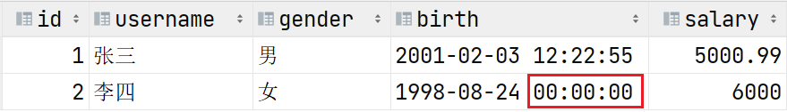

- **DATETIME类型插入数据时不能忽略年月日**

  ```sql
  INSERT INTO userinfo(id,username,gender,birth,salary)
  VALUES (3,'王五','男','12:15:32',5000)
  会报错，DATETIME字段不能只插入时分秒
  ```

  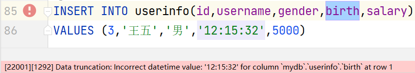

- 插入DOUBLE值时精度超过部分会四舍五入，整数部分若超过长度则会报错

  ```sql
  INSERT INTO userinfo(id,username,gender,birth,salary)
  VALUES (3,'王五','男','1985-06-01 12:15:32',100000)
  ```

  


### 约束条件

可以对表添加约束条件，这样一来仅当满足约束条件的操作才可以进行。这样做可以更好的为我们的业务服务，保证数据库的操作是服务业务要求的。

#### 主键约束(PRIMARY KEY)

- 主键的特点:**非空且唯一**。符合该特点的值才可以用来标识表中唯一的一条记录。
- 通常一张表中的第一个字段都是主键字段，名字通常选取为:id
- 主键约束一张表只能为一个字段添加

##### 例

```sql
CREATE TABLE user1(
                    id INT PRIMARY KEY,
                    name VARCHAR(30),
                    age INT(3)
);

INSERT INTO user1(id,name,age) VALUES (1,'张三',22)
  INSERT INTO user1(id,name,age) VALUES (2,'李四',33)
```

- 主键字段不能插入重复的值

  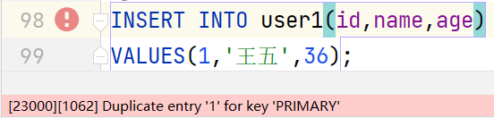

- 主键字段不能插入NULL值

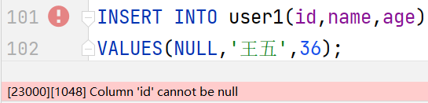

- 不能修改重复的值

  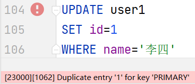

- 不能修改为NULL

  

##### 具体主键约束的字段通常会配合自增(AUTO_INCREMENT)使用

- 将字段定义为主键约束时，同时指定:**AUTO_INCREMENT**

  ```sql
  CREATE TABLE user2(
      id INT PRIMARY KEY AUTO_INCREMENT,
      name VARCHAR(30),
      age INT(3)
  );
  
  也可以修改现有的表字段
  ALTER TABLE user1 CHANGE id id INT PRIMARY KEY AUTO_INCREMENT
  ```

- 当主键字段具有自增功能时，插入数据则可以忽略主键字段的插入

  ```SQL
  INSERT INTO user2 (name,age) VALUES('张三',22)
  INSERT INTO user2 (name,age) VALUES('李四',33)
  ```

  

- 当显示的给自增字段插入NULL值时，该字段的值仍然会自增。(不推荐)

  ```sql
  INSERT INTO user2 (id,name,age) VALUES(NULL,'王五',36)
  ```


#### 非空约束(NOT NULL)

被非空约束修饰的字段表中每条记录该字段必须有值，不能为NULL

##### 例

```sql
CREATE TABLE user3(
	id INT PRIMARY KEY AUTO_INCREMENT,
	name VARCHAR(30) NOT NULL,
	age INT(3)
)

```

- 非空约束在查看表结构时有所体现

  ```sql
  DESC user3
  ```

  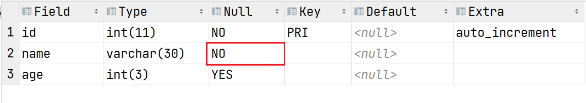

- 不能将NULL值插入具有非空约束的字段中

  ```sql
  INSERT INTO user3 (name,age) VALUES(NULL,22)
  ```

  

- 插入数据时不能忽略具有非空约束的字段(字段默认插入NULL)

  ```sql
  INSERT INTO user3(age) VALUES(33)
  ```

  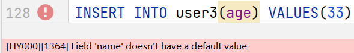


### DQL数据查询语言

DQL是用于查询表中数据的语言。

#### 语法:

```sql
SELECT 子句
FROM 子句
WHERE 子句
  JOIN...ON...子句
GROUP BY 子句
HAVING 子句
ORDER BY子句
```

一条DQL语句至少要包含的两个子句分别是SELECT子句和FROM子句

- SELECT子句用于指定查询的字段名称。选定的字段会体现在查询结果集中
- FROM子句用于指定数据来自那些表(指定查询的表)

#### 基础查询

由SELECT和FROM构成。

##### 语法:

- SELECT子句和FROM子句

  ```sql
  SELECT 字段1[,字段2,字段3,...]
  FROM 表1[,表2,表3...]
  ```

- SELECT子句中可以使用*表达查询所有的字段

  **实际开发中不推荐使用*,因为查询低效**

例

```sql
查询teacher表中的所有数据
SELECT * FROM teacher
上述SQL执行时，数据库会先解析"*",这个操作会导致数据库先查看内部数据字典了解表的字段后
才能查看表中数据。由于查询是非常频繁的操作，因此每次查看数据字段无疑是浪费性能且消耗时间的操作!
全字段查询时应当在SELECT子句中将所有字段全部列出来(后期java程序执行时)。
如果是手动临时查询，可以使用*。


查看每个老师的名字，职称，工资，性别
SELECT name,title,salary,gender
FROM teacher
```


#### WHERE子句

在DQL中用于筛选查询的记录。最终数据库仅将满足WHERE子句条件的记录体现在结果集中。

##### 例

- 查看职称为"一级讲师"的老师名字和工资?

  ```sql
  1:查询的是老师信息，能确定FROM子句中的表名为teacher
  2:查看的是老师的名字和工资，能确定SELECT子句中的字段name和salary
  3:由于仅查看"一级讲师",能确定WHERE子句过滤条件为title='一级讲师'
  SELECT name,salary,title
  FROM teacher
  WHERE title='一级讲师'
  ```


- 查看除'刘苍松'老师以外的其他老师的名字，工资和年龄?

  ```sql
  SELECT name,salary,age
  FROM teacher
  WHERE name<>'刘苍松'
  ```


- 查看所有职位是'大队长'的同学的名字年龄和性别

  ```sql
  SELECT name,age,gender
  FROM student
  WHERE job='大队长'
  ```


- 查看年龄在30(含)岁以上的老师都有谁？查看老师的名字,年龄,性别,工资

  ```sql
  SELECT name,age,gender,salary
  FROM teacher
  WHERE age>=30
  ```


##### 使用AND"与"和OR"或"来连接多个条件进行查询

- AND:都为真时才为真
- OR:都为假时才为假

例

- 查看7岁的大队长都是谁?列出:名字，年龄，性别，职位

  ```sql
  SELECT name,age,gender,job
  FROM student
  WHERE job='大队长' AND age=7
  ```

- 查看班级编号小于6的所有中队长的名字，年龄，性别，职位和所在班级编号

  ```sql
  SELECT name,age,gender,job,class_id
  FROM student
  WHERE class_id<6 AND job='中队长'
  ```

- 查看所有一级讲师和三级讲师的名字，职称，工资?

  ```sql
  SELECT name,title,salary
  FROM teacher
  WHERE title='一级讲师' OR title='三级讲师'
  ```


- 查看所有大队长，中队长和小队长的名字，年龄，性别

  ```sql
  SELECT name,age,gender
  FROM student
  WHERE job='大队长' OR job='中队长' OR job='小队长'
  ```


- 查看班级编号在6(含)以下的所有大队长和中队长的名字，年龄，职位，班级编号

  **AND的优先级是高于OR的**

  **可以使用()提高优先级**

  ```sql
  SELECT name,age,job,class_id
  FROM student
  WHERE class_id<=6 AND job='大队长' OR job='中队长'
  上述SQL的条件应当读作:查看班级编号6以下的大队长和所有班级编号的中队长
  
  
  SELECT name,age,job,class_id
  FROM student
  WHERE class_id<=6 AND (job='大队长' OR job='中队长')
  提高OR的优先级满足查询要求
  ```


##### IN(列表):等于列表其中之一(在列表中)

例

- 查看所有的大队长，中队长，小队长的名字，年龄，性别

  ```sql
  SELECT name,age,gender
  FROM student
  WHERE job='大队长' OR job='中队长' OR job='小队长'
  等价于
  SELECT name,age,gender
  FROM student
  WHERE job IN('大队长','中队长','小队长')
  ```


- 查看所有一级讲师，二级讲师，三级讲师的老师名字，职称和工资?

  ```sql
  SELECT name,title,salary
  FROM teacher
  WHERE title IN ('一级讲师','二级讲师','三级讲师')
  ```


##### NOT IN(列表):不在列表中，不能等于列表中的所有项

- 查看一级讲师和二级讲师以外的所有老师的名字，职称，工资?

  ```
  SELECT name,title,salary
  FROM teacher
  WHERE title NOT IN('一级讲师','二级讲师')
  ```


- 查看不是中队长和大队长以及小队长的其他学生的名字，年龄，职位

  ```sql
  SELECT name,age,job
  FROM student
  WHERE job NOT IN('大队长','中队长','小队长')
  ```


##### BETWEEN...AND...:在一个范围之内

- 查看工资在2000-5000之间的老师的名字，工资，职称?

  ```sql
  SELECT name,salary,title
  FROM teacher
  WHERE salary>=2000 AND salary<=5000
  等价于
  SELECT name,salary,title
  FROM teacher
  WHERE salary BETWEEN 2000 AND 5000
                       下限      上限
  ```


- 查看年龄在7-10岁之间的学生的名字，年龄，性别

  ```sql
  SELECT name,age,gender
  FROM student
  WHERE age BETWEEN 7 AND 10
  ```


- 查看年龄在20-35岁之间的男老师的名字，职称，年龄

  ```sql
  SELECT name,title,age
  FROM teacher
  WHERE age BETWEEN 20 AND 35
  AND gender='男'
  ```


- 查看3-5楼的班级名称都是什么?

  ```sql
  SELECT name
  FROM class
  WHERE floor BETWEEN 3 AND 5
  ```


##### DISTINCT去重操作。在结果集中去除指定字段值相同的记录

语法

```
SELECT DISTINCT 字段1[,字段2,...]
FROM 表名
...
```

- DISTINCT关键字必须紧跟在SELECT子句之后
- DISTINCT后面可以指定多个字段，当这几个字段组合相同的记录会在结果集中被去除

例

- 查看老师的职称都有哪些?

  ```sql
  SELECT title
  FROM teacher
  上述SQL语句的查询结果集是展现每个老师的职称，与查询需求不匹配
  
  SELECT DISTINCT title
  FROM teacher
  将查询结果集中重复的title去除后得到正确效果
  ```


- 查看学生的职位都有哪些?

  ```SQL
  SELECT DISTINCT job
  FROM student
  ```


- 查看各年龄的职位都有哪些?

  ```sql
  SELECT DISTINCT age,job
  FROM student
  ```

##### 练习:

```sql
1.查看负责课程编号(subject_id)为1的男老师都有谁?
  SELECT name,salary,title
  FROM teacher
  WHERE subject_id=1 AND gender='男'
  
2.查看工资高于5000的女老师都有谁?
  SELECT name,salary,title
  FROM teacher
  WHERE salary>5000 AND gender='女'
  
3.查看工资高于5000的男老师或所有女老师的工资？
  SELECT name,salary,gender
  FROM teacher
  WHERE salary>5000 AND gender='男' OR gender='女'

4.查看所有9岁学生的学习委员和语文课代表都是谁?
  SELECT name,job,age
  FROM student
  WHERE age=9 AND (job ='学习委员' OR job='语文课代表')

5.查看工资在6000到10000之间的老师以及具体工资?
  SELECT name,salary,title
  FROM teacher
  WHERE salary BETWEEN 6000 AND 10000
  
6.查看工资在4000到8000以外的老师及具体工资?
  SELECT name,salary,title
  FROM teacher
  WHERE salary NOT BETWEEN 4000 AND 8000
  
7.查看老师负责的课程编号都有什么?
  SELECT DISTINCT subject_id
  FROM teacher

8.查看所有女老师的职称都是什么?
  SELECT DISTINCT title
  FROM teacher
  WHERE gender='女'
  
9.查看7-10岁的男同学的职位都有哪些?
  SELECT DISTINCT job
  FROM student
  WHERE age BETWEEN 7 AND 10
  AND gender='男'
  
10.查看一级讲师和二级讲师的奖金(comm)是多少?
   SELECT name,comm
   FROM teacher
   WHERE title IN ('一级讲师','二级讲师')
   
11.查看除老板和总监的其他老师的工资和奖金是多少?
   SELECT name,title,salary,comm
   FROM teacher
   WHERE title NOT IN('老板','总监')

12.查看'3年级2班'和'5年级3班'在那层楼?
   SELECT name,floor
   FROM class
   WHERE name IN('3年级2班','5年级3班')
```


##### LIKE	模糊查询

LIKE中有两个通配符:

- _:下划线表示一个字符(1个)
- %:百分号表示任意个字符(0-多个)

组合示意:

```sql
%X%:字符串中含有X。
X%:字符串是以X字符开始的。
%X:字符串是以X字符结尾的。
__X:三个字符，且最后一个字符是X的。
%X_:倒数第二个字符是X的。
```

例

- 查看名字中含有'苍'的老师?

  ```sql
  SELECT name,title,salary
  FROM teacher
  WHERE name LIKE '%苍%'
  ```

- 查看姓'张'的学生都有谁?

  ```sql
  SELECT name,job,gender,age
  FROM student
  WHERE name LIKE '张%'
  ```

- 查看名字是以'晶'结尾的老师都有谁?

  ```sql
  SELECT name,title,salary
  FROM teacher
  WHERE name LIKE '%晶'
  ```

- 查看三个字名字且最后一个字是'平'的学生都有谁?

  ```sql
  SELECT name,job,gender,age
  FROM student
  WHERE name LIKE '__平'
  ```

- 查看三个字名字中第二个字符是'平'的学生都有谁?

  ```sql
  SELECT name,job,gender,age
  FROM student
  WHERE name LIKE '__平'
  ```

- 查看职位是'什么课什么表'的学生都有谁?

  ```sql
  SELECT name,job,gender,age
  FROM student
  WHERE job LIKE '%课%表'
  ```

- 查看所有2班都在哪层?

  ```sql
  SELECT name,floor
  FROM class
  WHERE name LIKE '%2班'
  ```

##### 练习

```sql
1.查询名字姓"李"的学生姓名
  SELECT name,age
  FROM student
  WHERE name LIKE '李%'
  
2.查询名字中包含"江"的学生姓名
  SELECT name,age
  FROM student
  WHERE name LIKE '%江%'
  
3.查询名字以"郭"结尾的学生姓名
  SELECT name,age
  FROM student
  WHERE name LIKE '%郭'
  
4.查询9-12岁里是"课代表"的学生信息
  SELECT name,age,job
  FROM student
  WHERE age BETWEEN 9 AND 12
  AND job LIKE '%课代表'
  
5.查询名字第二个字是"苗"的学生信息
  SELECT name,age
  FROM student
  WHERE name LIKE '_苗%'
  
6.查询姓"邱"的课代表都是谁?
  SELECT name,job
  FROM student
  WHERE name LIKE '邱%'
  AND job LIKE '%课代表'
```

##### NULL值判断

- 等于NULL:**IS NULL**
- 不等于NULL:**IS NOT NULL**
- **不能直接用=或<>判断NULL值**

例:

- 查看没有奖金的老师都有谁?(奖金字段值为null的记录)

  ```sql
  SELECT name,salary,comm
  FROM teacher
  WHERE comm=NULL
  上述SQL是查询不到任何记录的，因为comm的值不能用=来判断NULL。
  
  SELECT name,salary,comm
  FROM teacher
  WHERE comm IS NULL
  ```


- 查看有奖金的老师都有谁?

  ```sql
  SELECT name,salary,comm
  FROM teacher
  WHERE comm IS NOT NULL
  ```


### ORDER BY子句

**ORDER BY子句用于指定查询的结果集按照指定的字段进行排序**

- ORDER BY 字段名 [ASC]  将结果集按照指定的字段值升序排序(从小到大)
- ORDER BY 字段名 DESC  将结果集按照指定的字段值降序排序(从大到小)
- ORDER BY不指定排序方式时，默认为升序
- ORDER BY 可以按照多字段排序:**ORDER BY 字段1 ASC|DESC, 字段2.... ASC|DESC**
  - 多字段排序时，首先结果集按照第一个字段值的排序方式排序
  - 当第一个字段值相同的记录再按照第二个字段的排序方式继续排序
  - 以此类推
- **ORDER BY子句只能是DQL语句中的最后一个子句**

例:

- 查看老师工资的排名情况

  ```sql
  SELECT name,salary,title
  FROM teacher
  ORDER BY salary DESC
  ```


- 查看老师的奖金情况，按照从少到多排序。

  ```sql
  SELECT name,comm
  FROM teacher
  ORDER BY comm
  ```


- 查看学生的生日从远到近。

  ```sql
  日期字段排序是，越早的日期越小，越晚的日期越大。
  SELECT name,birth
  FROM student
  ORDER BY birth
  ```


- 查看7-10岁学生名字，年龄，生日。查看时按照年龄从小到大。

  ```
  SELECT name,age,birth
  FROM student
  ORDER BY age,birth DESC
  ```

- 查看老师的奖金和工资，按照奖金的升序，工资的降序

  ```sql
  SELECT name,comm,salary
  FROM teacher
  ORDER BY comm,salary DESC;
  ```

  


### 分页查询

当一条DQL语句可以查询出很多行记录时，为了减少资源开销，以及网络间的传送速度，我们通常都会使用分页查询来分批，分段的将DQL查询的结果集获取到。

分页是方言，标准SQL92标准中没有对分页的语法定义。

**在MYSQL中分页使用LIMIT实现**。在ORACLE中使用ROWNUM实现

#### 语法:

在ORDER BY子句中使用LIMIT N,M

```sql
ORDER BY 字段 
LIMIT N,M
```

- N表示跳过结果集的记录数

- M表示从跳过N条记录后开始连续显示M条记录

- 分页上两个条件:1:页数   2:每页显示的条数

  - N的公式:(页数-1)*每页显示的条数

  - M:每页显示的条数

  - 例如:一页显示15条，显示第3页?

    ```
    LIMIT (3-1)*15,15
    ```

例:

- 查看老师工资排名的前5名是谁?

  ```sql
  SELECT name,salary
  FROM teacher
  ORDER BY salary DESC
  LIMIT 0,5
  ```


- 按照老师奖金的降序排序后，每页显示3条，显示第5页

  ```sql
  - N的公式:(页数-1)*每页显示的条数
  - M:每页显示的条数
  SELECT name,comm
  FROM teacher
  ORDER BY comm DESC
  LIMIT 12,3
  ```


### DQL中可以使用函数或者表达式进行查询

#### 在SELECT子句中使用函数或表达式

##### 使用表达式

例:

- 查看每个老师的年薪是多少?

  ```sql
  SELECT name,salary,salary*12
  FROM teacher
  ```

##### 使用函数

**在计算表达式中，任何数字与NULL运算结果都是NULL**

**IFNULL(arg1,arg2)函数**

- 当arg1不为NULL时，函数返回arg1的值

- 当arg1为NULL时，函数返回arg2的值

- IFNULL作用时将一个NULL值换成一个非NULL值

- 内部逻辑

  ```java
  IFNULL(arg1,arg2){
  	if(arg1!=null){
  		return arg1;
  	}else{
  		return arg2
  	}
  }
  ```

例:

- 查看每个老师的工资+奖金是多少?

  ```sql
  SELECT name,salary,comm,salary+comm
  FROM teacher
  上述SQL对于salary+comm而言，若comm字段为NULL时计算结果也为NULL
  
  SELECT name,salary,comm,IFNULL(comm,0)
  FROM teacher
  上述SQL会将comm字段为null的记录将该字段改为0
  
  查看老师工资+奖金的实际写法:
  SELECT name,salary,comm,salary+IFNULL(comm,0)
  FROM teacher
  ```


#### 在WHERE子句中使用函数或表达式作为过滤条件

##### 使用表达式

例

- 查看年薪小于6万的老师都有谁?

  ```sql
  SELECT name,salary,salary*12
  FROM teacher
  WHERE salary*12<60000	查询时只有该条记录salary字段值*12小于60000的会被查出
  ```


##### 使用函数

例:

- 查看奖金小于3000的老师都有谁?

  **比较运算时也会忽略NULL值的**

  ```sql
  SELECT name,comm
  FROM teacher
  WHERE comm<3000
  上述查不出奖金字段为NULL的记录。
  
  SELECT name,comm
  FROM teacher
  WHERE IFNULL(comm,0)<3000
  ```


### 别名

- 别名可以在SELECT子句中为函数，表达式取别名，是的结果集中该字段可读性更强。

- 别名也可被用在其他子句上，比如在FROM子句中为表取别名，便于关联查询。

**当SELECT子句中含有函数或表达式时，通常都会指定别名**

#### 语法

- 字段名 别名

  ```sql
  SELECT salary*12 salary
  ```

- 字段名 AS 别名

  ```sql
  SELECT salary*12 AS salary
  ```

- 字段名 [AS] '字段名'

  ```sql
  SELECT salary*12 AS 'salary'
  或
  SELECT salary*12 'salary'
  ```

- 字段名 [AS] "字段名"

  ```sql
  SELECT salary*12 AS "salary"
  或
  SELECT salary*12 "salary"
  ```

- 当别名中含有SQL关键字或空格时要加引号

  ```
  SELECT name,salary*12 from     由于from是关键字，SQL语句语法错误(两次FROM)
  FROM teacher
  正确写法
  SELECT name,salary*12 'from'     
  FROM teacher
  
  下述SQL本意为salary*12取别名"annu sal"
  SELECT name,salary*12 annu sal   数据库理解annu为别名，再空格sal认为语法错误
  FROM teacher
  正确写法
  SELECT name,salary*12 'annu sal'
  FROM teacher
  
  ```


例:

- 查看每个老师的年薪是多少?

  ```sql
  SELECT name,salary*12 salary
  FROM teacher
  ```


### 练习

```sql
1.查询所有10岁学生的生日,按生日对应的年纪从大到小.
  SELECT name,age,birth
  FROM student
  WHERE age=10
  ORDER BY birth
  
2.查询8岁同学中名字含有"苗"的学生信息
  SELECT name,age
  FROM student
  WHERE age=8
  AND name LIKE '%苗%'

3.查询负责课程编号1和2号且工资高于6000的老师信息
  SELECT name,salary,subject_id
  FROM teacher
  WHERE salary>6000
  AND subject_id IN (1,2)

4.查询10岁以上的语文课代表和数学课代表
  SELECT name,age,job
  FROM student
  WHERE age>10
  AND job IN ('语文课代表','数学课代表')

5.查询不教课程编号1的老师信息,按照工资降序排序
  SELECT name,salary,subject_id
  FROM teacher
  WHERE subject_id<>1
  ORDER BY salary DESC

6.查询没有奖金的老师信息
  SELECT name,comm
  FROM teacher
  WHERE IFNULL(comm,0)=0

7.查询所有老师的奖金，并按照奖金降序排序
  SELECT name,comm
  FROM teacher
  ORDER BY comm DESC

8.查看工资高于8000的老师负责的课程编号都有那些?
  SELECT DISTINCT subject_id
  FROM teacher
  WHERE salary>8000
  
9.查看全校年龄最小学生的第6-10名
  SELECT name,age,birth
  FROM student
  ORDER BY birth DESC
  LIMIT 5,5
```


### 聚合函数

聚合函数(也称为多行函数，分组函数)是用来对结果集按照指定字段**统计**的。

聚合函数可以将多行记录中的指定字段统计出一条结果。

聚合函数:

- MIN:统计结果集中指定字段值最小的
- MAX:统计结果集中指定字段最大的
- AVG:统计结果集中指定字段的平均值
- SUM:统计结果集中指定字段的总和
- COUNT:统计结果集中指定字段非空值共多少行
- **聚合函数忽略NULL值的统计，在AVG和COUNT中最为明显**

MIN,MAX,AVG,SUM是对字段值的统计。COUNT是对记录数的统计。

**使用聚合函数时，通常要先将参与统计的记录查询出来后再决定添加何种聚合函数进行统计。**

例

- 查看所有老师的平均工资是多少?

  ```sql
  1:准备参与统计的记录对应的SQL语句
  下述SQL用来查询出所有老师的工资:
  SELECT salary
  FROM teacher
  
  2:为salary字段添加聚合函数，求所有记录salary的平均值
  SELECT AVG(salary)
  FROM teacher
  
  
  ```


- 查看所有老师的最高工资，最低工资，工资总和和平均工资分别是多少?

  ```sql
  SELECT MAX(salary),MIN(salary),SUM(salary),AVG(salary)
  FROM teacher
  ```


- 查看负责课程编号1的老师的平均工资是多少?

  ```sql
  1:查询出负责课程编号1的老师工资分别是多少?
  SELECT salary
  FROM teacher
  WHERE subject_id=1
  
  2:在上述SQL中对salary字段添加聚合函数求平均值
  SELECT AVG(salary)
  FROM teacher
  WHERE subject_id=1
  ```


- 查看共有多少位老师?

  **COUNT(*)作为统计被所有数据库都进行了优化，因此统计记录数时就用它**

  ```sql
  SELECT COUNT(name)
  FROM teacher
  上述SQL统计结果共20条。teacher表中每条记录的name都有值
  
  SELECT COUNT(comm)
  FROM teacher
  上述SQL统计结果共17条。原因:teacher表中有3条记录comm字段值为NULL
  聚合函数是忽略NULL值的
  
  SELECT COUNT(*)
  FROM teacher
  ```


- 查看所有老师的平均奖金

  ```sql
  SELECT AVG(comm),SUM(comm)
  FROM teacher
  上述SQL是对comm字段有的所有记录取平均值
  
  将NULL值替换为非NULL值再进行统计
  SELECT AVG(IFNULL(comm,0))
  FROM teacher
  
  ```


- 查看负责课程编号1的老师共几人？

  ```sql
  SELECT COUNT(*)
  FROM teacher
  WHERE subject_id=1
  ```


- 查看班级编号(class_id)为1的学生有多少人?

  ```sql
  SELECT COUNT(*)
  FROM student
  WHERE class_id=1
  ```


- 查看全校学生生日最大的是哪天?

  ```sql
  SELECT MIN(birth)
  FROM student
  ```


- 查看11岁的课代表总共多少人?

  ```sql
  SELECT COUNT(*)
  FROM student
  WHERE age=11
  AND job LIKE '%课代表'
  ```


### GROUP BY子句，分组

GROUP BY子句在DQL语句中是对查询结果集按照指定的字段值相同的记录进行分组，配合聚合函数进行组内统计。

**若DQL的SELECT子句中没有聚合函数时，不会使用GROUP BY子句。**

**在SELECT子句中不在聚合函数中的字段都必须出现在GROUP BY子句中**

#### 按照单字段分组

例

- 教每门课程的老师的平均工资是多少?

  ```sql
  SELECT AVG(salary),subject_id
  FROM teacher
  GROUP BY subject_id
  
  GROUP BY子句的作用是将:
  SELECT salary,subject_id
  FROM teacher
  查询结果集按照subject_id字段值相同的记录分组，在组内统计结果。
  ```

  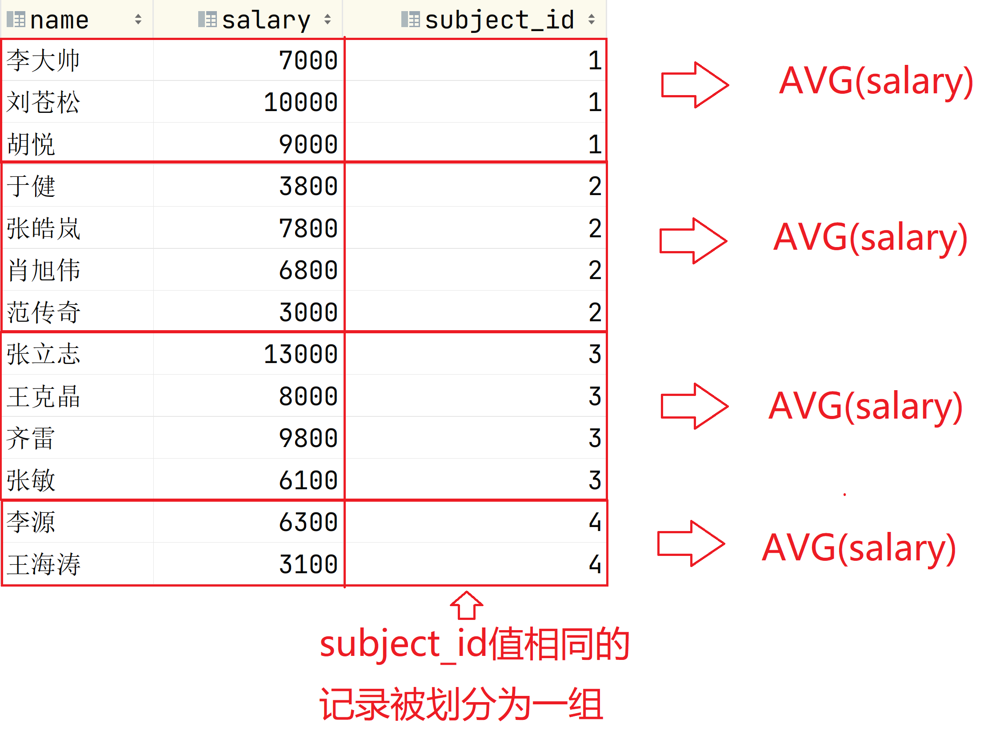

- 查看每个班级各多少学生?(将student表中所有记录按照class_id字段值相同的记录分组，组内统计记录数)

  ```sql
  SELECT COUNG(*),class_id
  FROM student
  GROUP BY class_id
  ```


- 查看学校每种职位的学生各多少人?以及最大生日和最小生日

  ```sql
  SELECT COUNT(*) '人数',MIN(birth) '最大生日',MAX(birth) '最小生日',job
  FROM student
  GROUP BY job
  ```


#### 按照多字段分组

GROUP BY子句若指定了多个字段，那么只有当这几个字段值都相同的记录才会被划分为一组。

例

- 查看每个班每种职位各多少人?

  ```sql
  SELECT COUNT(*),job,class_id
  FROM student
  GROUP BY job,class_id
  ```


#### 按照聚合函数排序

在SELECT子句中为聚合函数取别名，这样方便在ORDER BY子句中排序

例

- 查看每个科目老师的平均工资，并按照平均工资从少到多排序

  ```sql
  SELECT AVG(salary),subject_id
  FROM teacher 
  GROUP BY subject_id
  ORDER BY AVG(salary)
  
  建议为聚合函数取别名，并按照该别名排序
  SELECT AVG(salary) avg,subject_id
  FROM teacher
  GROUP BY subject_id
  ORDER BY avg
  ```


#### HAVING子句，在分组统计时添加过滤条件

例

- 仅查看平均工资高于6000的那些课程的老师平均工资

  ```sql
  SELECT AVG(salary),subject_id
  FROM teacher
  WHERE AVG(salary)>6000
  GROUP BY subject_id
  ```

  执行后报错:

  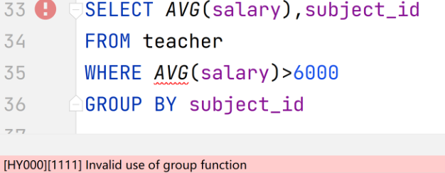

##### 聚合函数不能被应用与WHERE子句

原因:过滤实际不同

- WHERE条件实在检索表中数据时，每检索一行记录就会进行一次WHERE，来决定该条记录是否被查询出来

- 聚合函数想作为过滤条件(将统计结果作为过滤条件)，统计的前提时要先查询出结果集，而查询结果集是WHERE的实际。因此根据统计结果再进行过滤应当已经是WHERE之后进行的了。


##### HAVING子句

HAVING子句仅跟在GROUP BY之后。因此若没有GROUP BY子句就不会写HAVING子句。

HAVING子句也是用于添加过滤条件的，过滤时机:分组统计出结果后进行二次过滤的。

**HAVING子句是对分组过滤的:只有满足HAVING子句条件的分组才会进行SELECT中相应的统计。**

**WHERE子句是对记录过滤的:只有满足WHERE子句条件的记录才会进行SELECT中相应的查询**

**WHERE先执行，用于确定查询出的结果集。HAVING后执行用于确定保留结果集中的那些分组**

例

- 仅查看平均工资高于6000的那些课程的老师平均工资

  ```sql
  											子句执行顺序
  SELECT AVG(salary),subject_id               4:最后查询对应的内容(仅查询满足HAVING要求的组)
  FROM teacher								1:确定数据来自哪里
  GROUP BY subject_id							2:确定数据按照哪个字段分组(按照subject_id分6组)
  HAVING AVG(salary)>6000                     3:确定仅保留哪些分组(仅有3组符合AVG要求)
  ```


- 查看每个科目老师的平均工资，前提是该科老师最高工资高于9000.

  ```sql
  SELECT AVG(salary),subject_id       4:最后将过滤出的2组进行统计结果
  FROM teacher						1:确定数据来自teacher表
  GROUP BY subject_id                 2:按照subject_id字段值相同的可被分出6组
  HAVING MAX(salary)>9000             3:分出的6组都要看最高工资是否>9000,最终过滤出2组。
  ```


- 查看科目老师的工资总和是多少?前提是该科老师的平均奖金要高于4000.

  ```sql
  SELECT SUM(salary),subject_id
  FROM teacher
  GROUP BY subject_id
  HAVING AVG(IFNULL(comm,0))>4000
  ```


### 子查询

嵌套在其他SQL语句中的一条DQL语句就被称为子查询。

#### 子查询使用场景

- DQL中:可以基于一个查询结果集再进行查询(先执行的这条DQL就是子查询，也是子查询最常用的场景)
- DML中:基于一个查询结果集进行增删改操作
- DDL中:基于一个查询结果集进行数据库对象的操作(创建表，创建视图)

#### 子查询分类

- 单行单列子查询:查询结果集中只有一个值
- 多行单列子查询:查询结果集中有多个值
- 多行多列子查询:查询结果集就是一张表

#### 在DQL语句中使用子查询

**在DQL中子查询部分要被"()"括起来使用**

例:

- 查看哪个老师的工资高于王克晶的工资?

  1. 查询王克晶的工资是多少?

     ```sql
     SELECT salary 
     FROM teacher 
     WHERE name='王克晶'
     通过上述SQL我们可以得到一个单行单列的查询结果集:salary===>8000
     ```

  2. 查看谁的工资高于8000(王克晶的工资)?

     ```sql
     SELECT name,salary 
     FROM teacher 
     WHERE salary>8000
     ```


3. 将步骤1的SQL替换为步骤2的8000

   ```sql
   示意: 
   int money = SELECT salary FROM teacher WHERE name='王克晶'    不是真实语法！！！
   查询示意:
   SELECT name,salary 
   FROM teacher 
   WHERE salary>money
   
   真实写法:
   SELECT name,salary 
   FROM teacher 
   WHERE salary>(SELECT salary 
                 FROM teacher 
                 WHERE name='王克晶')
   
   
   ```


- 查看那些高于老师平均工资的老师工资都是多少?

  ```sql
  1:查看老师的平均工资是多少?
  SELECT AVG(salary)
  FROM teacher
  
  2:谁的工资高于平均工资?
  SELECT name,salary
  FROM teacher
  WHERE salary>(SELECT AVG(salary)
  			  FROM teacher)
  ```


- 查看和'李费水'在同一个班的学生都有谁?

  ```sql
  1:查看‘李费水’所在班级的班级号
  SELECT class_id
  FROM student
  WHERE name='李费水'
  
  2:查看和'李费水'在同一个班的学生都有谁?
  SELECT name,class_id
  FROM student
  WHERE class_id=(SELECT class_id
  				FROM student
  				WHERE name='李费水')
  ```


- 查看工资最高的老师的工资和奖金是多少?

  ```sql
  1:最高工资是多少?
  SELECT MAX(salary) FROM teacher
  
  2:查看工资最高的老师的工资和奖金是多少?
  SELECT name,salary,comm
  FROM teacher
  WHERE salary=(SELECT MAX(salary) FROM teacher)
  ```

##### 在单行单列子查询中，若我们使用其作为过滤条件使用时，可以搭配:=, >, >=, <, <=, <>使用

##### 在多行单列子查询中(查询结果集有多个值)，在过滤条件中要搭配:IN,ANY,ALL

- ANY与ALL是与:>, >=, <, <=联合使用的
  - \>ANY(列表):大于列表其中之一(大于最小的即可)
  - <ANY(列表):小于列表其中之一(小于最大的即可)
  - \>ALL(列表):大于列表所有(大于最大的)
  - <ALL(列表):小于列表所有(小于最小的)

- IN(列表)或NOT IN(列表):在列表中或不在列表中
- 上述所说的列表指的是一个多行单列子查询的结果集

例

- 查看与"祝雷"和"李费水"在同一个班的学生都有谁?

  ```sql
  1:查看祝雷和李费水的班级号?
  SELECT class_id
  FROM student
  WHERE name IN('祝雷','李费水')
  
  2:查看与"祝雷"和"李费水"在同一个班的学生都有谁?
  SELECT name,class_id
  FROM student
  WHERE class_id=(SELECT class_id
                  FROM student
                  WHERE name IN('祝雷','李费水'))
  上述SQL执行后会报错，因为子查询返回了多个值，"="不能同时等于多个值           
  ```

  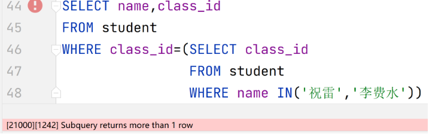

  正确写法:

  ```
  SELECT name,class_id
  FROM student
  WHERE class_id IN(SELECT class_id
                    FROM student
                    WHERE name IN('祝雷','李费水'))
  ```

  

- 查看比教科目2和科目4老师工资都高的老师都有谁?

  ```sql
  1:查看科目2和科目4老师的工资都是多少?
  SELECT salary FROM teacher WHERE subject_id IN(2,4)
  
  2:查看比教科目2和科目4老师工资都高的老师都有谁?
  SELECT name,salary,subject_id
  FROM teacher
  WHERE salary>ALL(SELECT salary 
                   FROM teacher 
                   WHERE subject_id IN(2,4))
  ```

  

#### 在DML中使用子查询

例:

- 将负责与"范传奇"教同一科目的所有老师工资涨500

  ```sql
  1:查看范传奇负责的科目号？
  SELECT subject_id
  FROM teacher
  WHERE name='范传奇'
  
  2:更新数据
  UPDATE teacher
  SET salary=salary+500
  WHERE subject_id=(SELECT subject_id
  				  FROM teacher
  				  WHERE name='范传奇')
  ```


#### 在DDL中使用子查询

##### 在创建表时，可以将一个子查询的结果集当作表创建出来。后期使用的视图也是如此。

例:

- 创建一张表用于记录老师工资的统计情况(按照科目)。要记录每门课老师的最高工资，最低工资，平均工资和工资总和以及科目编号。表名:teacher_salary_info

  ```SQL
  1:创建表
  CREATE TABLE teacher_salary_info(
  	max_salary INT,
      min_salary INT,
      avg_salary INT,
      sum_salary INT,
      subject_id INT
  )
  2:先执行DQL查询对应结果，在使用DML中的INSERT语句逐行插入。
    若数据太多，工作量太大且笨重。
  SELECT MAX(salary),MIN(salary),AVG(salary),SUM(salary),subject_id
  FROM teacher
  GROUP BY subject_id
  
  实际写法:
  注意:如果子查询的SELECT子句中的字段是函数或表达式则必须要指定别名(会作为新创建的表的字段名)
  CREATE TABLE teacher_salary_info
  AS
  SELECT MAX(salary) max_sal,MIN(salary) min_sal,
         AVG(salary) avg_sal,SUM(salary) sum_sal,
         subject_id
  FROM teacher
  GROUP BY subject_id
  
  ```

  

### 关联查询(重点知识)

**结果集中的字段来自于多张表。联合多张表进行查询。**

表与表之间的数据存在着一种对应关系，这种对应关系被称为表与表之间的关联关系。

表之间的关联关系分为三种:

一对一:A表的一条记录仅对应B表的一条记录。反之亦然。

一对多:A表的一条记录对应B表的多条记录，反之B表的一条记录仅对应A表的一条记录。A与B是一对多的。

多对多:当两张表双向都是一对多时就是多对多关系。

**在关联查询中必须要指定连接条件，连接条件作用是让数据库直到A表的记录与B表的哪些记录对应**

**关联查询中不指定连接条件会产生笛卡尔积，笛卡尔积通常是一个无意义的结果集(少数特殊业务除外)**

**多张表进行关联查询时，要满足当N张表联合查询时要指定最少N-1个连接条件。**

- 例如:3张表关联查询就至少要有2个连接条件。5张表关联查询就至少要有4个连接条件。


#### 笛卡尔积

缺少连接条件产生笛卡尔积

特点:

**以两张表A和B关联查询，结果集中包含的数据A表每条记录与B表每条记录产生的记录数。记录总数应当时A表记录数*B表记录数。**


#### 关联查询语法:

```sql
SELECT 字段...
FROM 表A,表B,...
WHERE 连接条件
AND 过滤条件
注意:如果在关联查询中含有过滤条件时必须与连接条件同时满足，否则会产生笛卡尔积
```

#### 例

- 查看类名老师的名字和其任课的科目名称?

  ```sql
  SELECT t.name,s.name
  FROM teacher t,subject s
  WHERE t.subject_id=s.id
  
  实际查询时，数据库会从teacher表中将其中一条记录与subject表中的每条记录都关联一次，但是仅将符合连接条件的记录分别取出查询的字段构成结果集中的一条记录。
  ```

  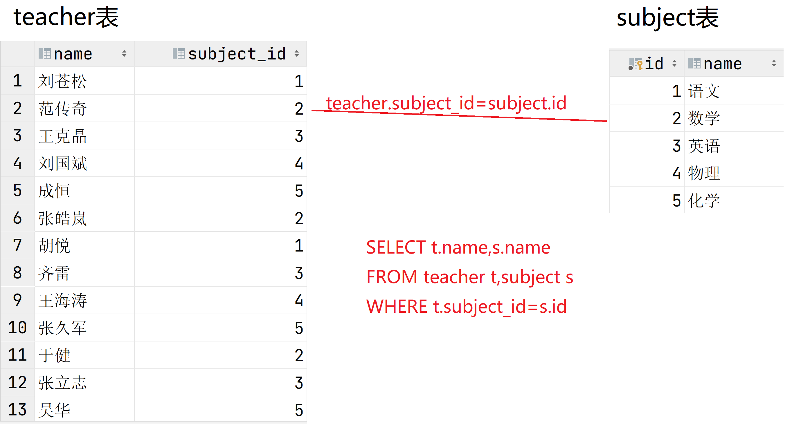

  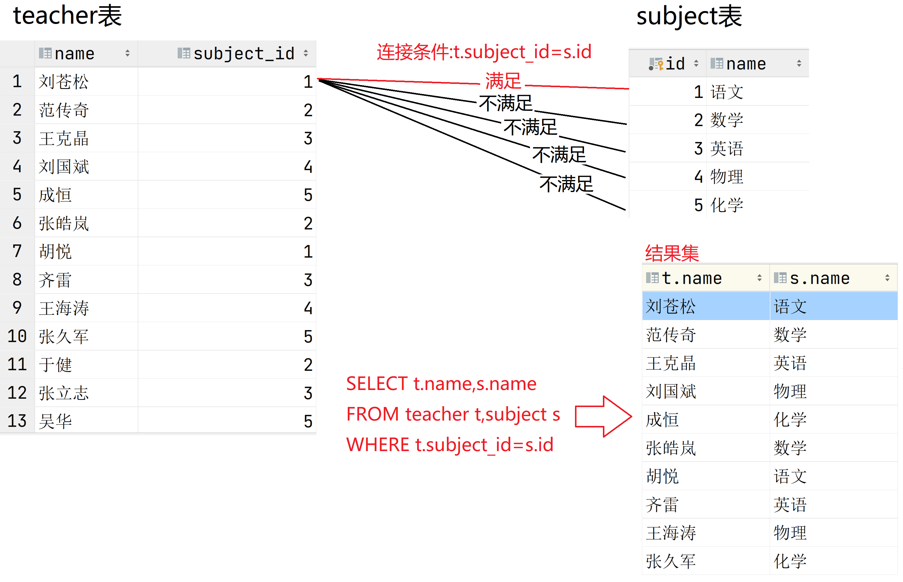

- 不指定连接条件时，可以通过结果集看出teacher表的每条记录都与subject表每条记录关联了一次产生一条结果(产生了笛卡尔积，记录数是teacher表的20条与subject表的5条的乘积，共100条记录！！！)

  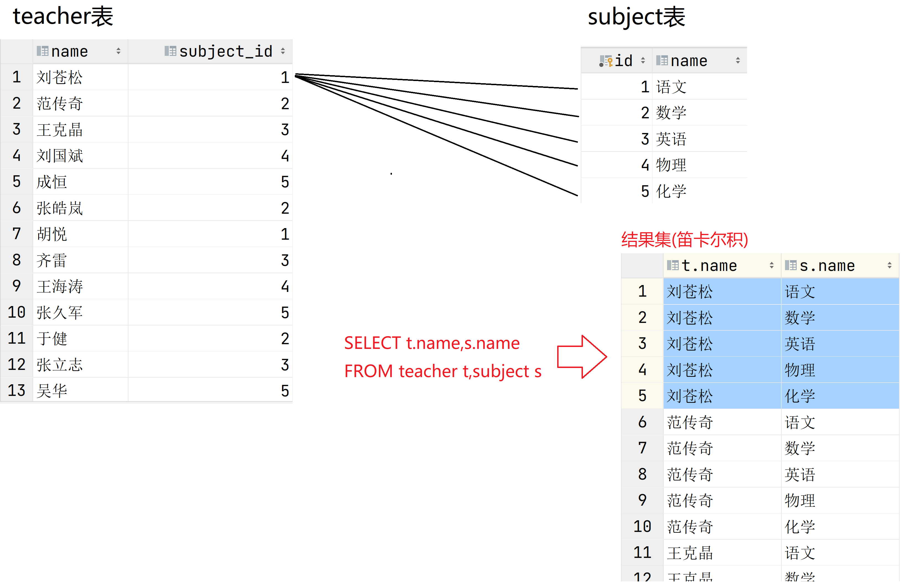


- 查看班级的名称和对应的班主任(老师)是谁?

  ```sql
  1:数据需要来自哪些表?
  班级名称来自class表。老师名字来自teacher表。
  明确FROM子句内容:FROM class c,teacher t
  
  2:明确class表与teacher表记录之间的对应关系(关联关系)
  class表记录中teacher_id字段的值与teacher表记录中id字段的值相同的记录产生对应关系。
  明确WHERE子句连接条件:WHERE c.teacher_id=t.id
  
  SELECT c.name,t.name
  FROM class c,teacher t
  WHERE c.teacher_id=t.id
  
  
  ```

  

- 查看每个学生的名字，年龄，以及其所在的班级名称和所在楼层

  ```sql
  1:确定数据来自哪些表?
  学生信息来自student表。班级信息来自class表
  明确FROM子句:FROM student s,class c
  
  2:student表与class表记录的对应关系?
  学生表某条记录的class_id值与class表某记录的id值相同的产生对应关系
  明确WHERE子句连接条件:s.class_id=c.id
  
  SELECT s.name,s.age,c.name,c.floor
  FROM student s,class c
  WHERE s.class_id=c.id
  ```

  

##### 关联查询中可以指定过滤条件

过滤条件要与连接条件同时满足

例

- "王克晶"是哪个班的班主任?查看班级名称，所在楼层和班主任名字以及工资

  ```sql
  SELECT c.name,c.floor,t.name,t.salary
  FROM class c,teacher t
  WHERE c.teacher_id=t.id
  AND t.name='王克晶'
  ```

  

- 查看三年级的班级班主任都是谁?要列出班级名称，所在楼层，班主任名字和工资

  ```sql
  SELECT c.name,c.floor,t.name,t.salary
  FROM class c,teacher t
  WHERE c.teacher_id=t.id
  AND c.name LIKE '3年级%'
  ```

  

- 查看5年级的中队长都有谁?要列出学生名字，年龄，性别，职位和所在班级的名字以及楼层

  ```sql
  SELECT s.name,s.age,s.gender,s.job,c.name,c.floor
  FROM student s,class c
  WHERE s.class_id=c.id		连接条件
  AND c.name LIKE '5年级%'     过滤条件
  AND s.job='中队长'			  过滤条件
  ```

  

#### N张表关联查询至少要有N-1个连接条件

例

- 查看"范传奇"所带班级的学生都有谁?要列出:学生名字，年龄，班级名称，老师名字

  ```sql
  1:查询的数据来自哪些表
  学生信息来自student表。班级信息来自class表。老师信息来自teacher表
  明确FROM子句:FROM student s,class c,teacher t
  
  2:明确连接条件
    3张表关联至少要有2个连接条件
    2.1:学生表与班级表中的记录对应关系
    s.class_id=c.id
    2.2:班级表与老师表中的记录对应关系
    c.teacher_id=t.id
  
  3:过滤条件来自哪张表?
    老师名字叫"范传奇"，来自teacher表
  
  SELECT s.name,s.age,c.name,t.name
  FROM student s,class c,teacher t
  WHERE s.class_id=c.id    连接条件
  AND c.teacher_id=t.id    连接条件    注:所有的连接条件要同时满足
  AND t.name='范传奇'       过滤条件
  
  
  ```

  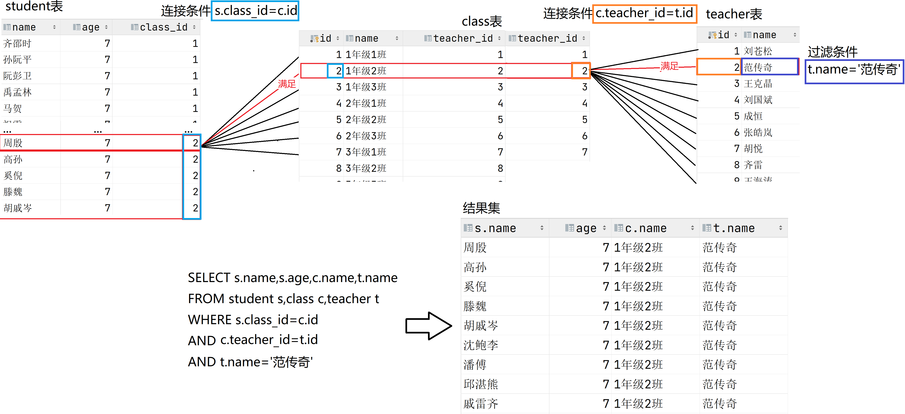


- 查看1年级1班的同学的名字和来自的城市

  ```
  1:数据来自那些表
  城市信息来自location表。学生信息来自student表
  
  2:过滤条件来自哪些表?
  查看1年级1班的。条件来自class表。
  确定WHERE子句的过滤条件:c.name='1年级1班'
  
  上述两条联合确定
  FROM子句:FROM location l,student s,class c
  
  3:连接条件
    3.1:班级与学生的连接条件:c.id=s.class_id
    3.2:学生与城市的连接条件:s.location_id=l.id
  WHERE子句连接条件:WHERE c.id=s.class_id AND s.location_id=l.id 
  
  SELECT s.name,l.name  
  FROM location l,student s,class c
  WHERE c.id=s.class_id AND s.location_id=l.id 		连接条件
  AND c.name='1年级1班'								  过滤条件
  
  ```

  

  #### 练习:

  ```sql
  1.查看来自北京的学生都是谁?
  SELECT s.name,l.name
  FROM location l,student s
  WHERE l.id=s.location_id
  AND l.name='北京'
  
  2.教"英语"的老师都是谁?
  SELECT t.name,s.name
  FROM teacher t,subject s
  WHERE t.subject_id=s.id
  AND s.name='英语'
  
  3.刘苍松所带班级的学生都有谁?
  SELECT t.name,c.name,s.name
  FROM teacher t,class c,student s
  WHERE t.id=c.teacher_id
  AND s.class_id=c.id
  AND t.name='刘苍松'
  
  4.教语文的老师所带的班级有哪些?
  SELECT s.name,t.name,c.name
  FROM subject s,teacher t,class c
  WHERE s.id=t.subject_id
  AND t.id=c.teacher_id
  AND s.name='语文'
  
  5.王克晶所带的班级学生都来自哪些城市(去重)?
  SELECT DISTINCT l.name
  FROM teacher t,class c,student s,location l
  WHERE t.id=c.teacher_id
  AND c.id=s.class_id
  AND l.id=s.location_id
  AND t.name='王克晶'
  
  6.3年级的几个班主任都教哪些课程?
  SELECT c.name,t.name,s.name
  FROM class c,teacher t,subject s
  WHERE c.teacher_id=t.id
  AND t.subject_id=s.id
  AND c.name LIKE '3年级%'
  
  7.工资高于10000的老师所带班里的大队长都是谁?
  SELECT t.name,c.name,s.name,s.job
  FROM teacher t,class c,student s
  WHERE t.id=c.teacher_id
  AND c.id=s.class_id
  AND t.salary>10000
  AND s.job='大队长'
  
  8."李费水"的班主任教哪门课?
  SELECT st.name,c.name,t.name,su.name
  FROM student st,class c,teacher t,subject su
  WHERE st.class_id=c.id
  AND c.teacher_id=t.id
  AND t.subject_id=su.id
  AND st.name='李费水'
  
  9.所在4楼的班里的大队长和中队长以及班主任都是谁?
  SELECT s.name,s.job,c.name,c.floor,t.name
  FROM student s,class c,teacher t
  WHERE s.class_id=c.id
  AND c.teacher_id=t.id
  AND c.floor=4
  AND s.job IN('大队长','中队长')
  
  如果用OR连接过滤条件，要注意OR的优先级低的问题。仍然要保证连接条件与过滤条件同时满足
  SELECT s.name,s.job,c.name,c.floor,t.name
  FROM student s,class c,teacher t
  WHERE s.class_id=c.id
  AND c.teacher_id=t.id
  AND c.floor=4
  AND (s.job='大队长' OR  s.job='中队长')
  
  10.全校最小的同学的班主任是谁?
  SELECT s.name,s.birth,c.name,t.name
  FROM student s,class c,teacher t
  WHERE s.class_id=c.id
  AND c.teacher_id=t.id
  AND s.birth=(SELECT MAX(birth) FROM student)
  
  去掉重复值
  SELECT DISTINCT t.name
  FROM student s,class c,teacher t
  WHERE s.class_id=c.id
  AND c.teacher_id=t.id
  AND s.birth=(SELECT MAX(birth) FROM student)
  ```
  
  

#### 关联查询中使用聚合函数

例

- 查看范传奇所带班级的学生共多少人?

  ```sql
  1:要参与统计的记录都查出来
  SELECT t.name,c.name,s.name
  FROM teacher t,class c,student s
  WHERE t.id=c.teacher_id
  AND c.id=s.class_id
  AND t.name='范传奇'
  
  2:在上述SQL中应用聚合函数
  SELECT COUNT(*)
  FROM teacher t,class c,student s
  WHERE t.id=c.teacher_id
  AND c.id=s.class_id
  AND t.name='范传奇'
  ```

  

- 查看教语文的老师平均工资是多少?

  ```sql
  1.准备参与统计的记录(教语文的老师的工资信息)
  SELECT s.name,t.name,t.salary
  FROM subject s,teacher t
  WHERE s.id=t.subject_id
  AND s.name='语文'
  
  2:对工资字段加聚合函数AVG
  SELECT AVG(t.salary)
  FROM subject s,teacher t
  WHERE s.id=t.subject_id
  AND s.name='语文'
  ```

  

- 查看每门课的平均工资是多少?(GROUP BY)

  ```sql
  1:准备参数统计的记录(科目信息，老师名字，老师工资)
  SELECT t.name,t.salary,s.name
  FROM teacher t,subject s
  WHERE t.subject_id=s.id
  
  2:对工资求平均值，要按照科目名称相同的老师记录分组
  SELECT AVG(t.salary),s.name
  FROM teacher t,subject s
  WHERE t.subject_id=s.id
  GROUP BY s.name
  
  ```

  - 仅查看平均工资高于6000的那些科目的老师平均工资是多少?

    ```
    SELECT AVG(t.salary),s.name
    FROM teacher t,subject s
    WHERE t.subject_id=s.id
    GROUP BY s.name
    HAVING AVG(t.salary)>6000
    ```

  - 满足上述要求的同时平均工资排名

    ```sql
    SELECT AVG(t.salary) avg,s.name
    FROM teacher t,subject s
    WHERE t.subject_id=s.id
    GROUP BY s.name
    HAVING AVG(t.salary)>6000
    ORDER BY avg DESC
    ```

    

- 查看工资最低的老师班里的学生共多少人?

  ```sql
  1:未知条件->最低工资是多少?
  SELECT MIN(salary) FROM teacher
  
  2:准备参与统计的数据
    工资最低的那个老师的班里的学生都有谁?
    SELECT s.name,c.name,t.name
    FROM teacher t,class c,student s
    WHERE t.id=c.teacher_id
    AND c.id=s.class_id
    AND t.salary=(SELECT MIN(salary) FROM teacher)
    
  3:添加聚合函数统计
    SELECT COUNT(*)
    FROM teacher t,class c,student s
    WHERE t.id=c.teacher_id
    AND c.id=s.class_id
    AND t.salary=(SELECT MIN(salary) FROM teacher)
  ```

#### 主键与外键

**在多表关联查询中，连接条件通常就是参与查询的表中的某字段的等值连接。**

**通常就是主键与外键的等值连接**

例

以student表与class表关联查询为例。

班级表中id字段作为班级表的**主键**(Primary Key)。特点:非空且唯一

学生表中class_id字段，该字段记录着该学生所在的班级的信息。为了让学生信息与其所在的班级信息产生对应关系，而设计了class_id字段，用于记录其所在的班级在班级表(class表)中记录的该班的id值。此时在学生表中class_id字段就被称为是其对应的class表主键所关联的**外键**(Foreign Key)

在关联关系中，存在外键字段的表与之对应的保存主键字段值的表就是"多对一"的关系。保存外键字段的表在关联关系中处于"多"的一方。

**外键在数据库中也存在外键约束**

外键约束的要求:

外键字段保存的值必须是其对应的主键字段中已有的值。

- 例如:student表与class表。  student表的class_id为外键，对应的是class表id这个主键

  - class表有3条记录，id分别是1,2,3。此时student表任何记录中class_id可选值仅为1,2,3,NULL。若class_id值为4则违反外键约束。

  

删除主键表中的某条记录时，必须保证该记录主键所对应的外键表中没有一条记录的外键保存该主键字段值。

- 例如:student表与class表。  student表的class_id为外键，对应的是class表id这个主键
  - class表有1条id为1的班级记录，同时student表中有三个学生记录的class_id为1.此时若删除class表中id为1的这条记录是不被允许的(原因是3个学生的外键记录着该该主键值)。

**结论:表设计中通常不使用外键约束，我们都是在程序中以主外键作为关联查询的条件而已**


#### 多对多关系

当两张表双向都是一对多时，就是多对多关系。

##### 关联关系表

多对多关系在表设计时，通常要添加一张**关联关系**表来维持两张表的多对多关系。

关联关系表通常不需要主键字段，并且一定有两个字段分别是多对多关系的两张表中各自主键所对应的外键字段。

例

学生表Student与科目表Subject就是多对多的。

从学生表角度出发:一个学生可以对应多个科目

从科目表角度出发:一个科目可以对应多个学生

关联关系表中有两个字段分别记录了这两张表的主键字段。

t_stu_subject_score表，该表有两个字段stu_id，subject_id分别记录了student表的id和subject表的id。因此依靠这张表就可以实现student与subject表的多对多关系。

**实际查询就是一个三张表的关联查询**

例:

查看'李费水'都学了哪门课以及该门课程的成绩?

```sql
SELECT s.name,su.name,sss.score
FROM student s,t_stu_subject_score sss,subject su
WHERE s.id=sss.stu_id
AND sss.subject_id=su.id
AND s.name='李费水'
```

##### 练习

```sql
1.查看1年级1班所有同学的语文成绩是多少?
SELECT c.name,s.name,su.name,sss.score
FROM class c,student s,t_stu_subject_score sss,subject su
WHERE c.id=s.class_id
AND s.id=sss.stu_id
AND sss.subject_id=su.id
AND c.name='1年级1班'
AND su.name='语文'

2.统计1年级1班数学成绩的平均值?
SELECT AVG(sss.score)
FROM class c,student s,t_stu_subject_score sss,subject su
WHERE c.id=s.class_id
AND s.id=sss.stu_id
AND sss.subject_id=su.id
AND c.name='1年级1班'
AND su.name='数学'

3.统计6年级的英语成绩的平均值?
SELECT AVG(sss.score)
FROM class c,student s,t_stu_subject_score sss,subject su
WHERE c.id=s.class_id
AND s.id=sss.stu_id
AND sss.subject_id=su.id
AND c.name LIKE '6年级%'
AND su.name='英语'

4.查看"刘苍松"所带班级的英语平均分?
先找到刘苍松所带班级每位同学的英语成绩
SELECT t.name,c.name,s.name,su.name,sss.score
FROM teacher t,class c,student s,t_stu_subject_score sss,subject su
WHERE t.id=c.teacher_id
AND c.id=s.class_id
AND s.id=sss.stu_id
AND su.id=sss.subject_id
AND t.name='刘苍松'
AND su.name='英语'

为成绩添加聚合函数
SELECT AVG(sss.score)
FROM teacher t,class c,student s,t_stu_subject_score sss,subject su
WHERE t.id=c.teacher_id
AND c.id=s.class_id
AND s.id=sss.stu_id
AND su.id=sss.subject_id
AND t.name='刘苍松'
AND su.name='英语'

5.查看工资最高的老师所带班级的各科成绩的平均分，最高分和最低分分别是多少?
先查看老师的最高工资是多少?
SELECT MAX(salary) FROM teacher

工资最高的老师所带班里每位同学的每一科成绩
SELECT t.name,c.name,s.name,su.name,sss.score
FROM teacher t,class c,student s,t_stu_subject_score sss,subject su
WHERE t.id=c.teacher_id
AND c.id=s.class_id
AND s.id=sss.stu_id
AND su.id=sss.subject_id
AND t.salary=(SELECT MAX(salary) FROM teacher)

添加分组及聚合函数。需求是看"各科"因此要将科目相同的记录看作一组 GROUP BY su.name
SELECT su.name,AVG(sss.score)
FROM teacher t,class c,student s,t_stu_subject_score sss,subject su
WHERE t.id=c.teacher_id
AND c.id=s.class_id
AND s.id=sss.stu_id
AND su.id=sss.subject_id
AND t.salary=(SELECT MAX(salary) FROM teacher)
GROUP BY su.name

6.查看所有大队长的5门成绩平均分是多少？
SELECT s.name,s.job,su.name,sss.score
FROM student s,t_stu_subject_score sss,subject su
WHERE s.id=sss.stu_id
AND sss.subject_id=su.id
AND s.job='大队长'
ORDER BY s.name

SELECT s.name,AVG(sss.score)
FROM student s,t_stu_subject_score sss,subject su
WHERE s.id=sss.stu_id
AND sss.subject_id=su.id
AND s.job='大队长'
GROUP BY s.name
```


#### 内连接

#### 语法:

```sql
SELECT 子句
FROM 表1
JOIN 表2 ON 连接条件
[JOIN 表3 ON 连接条件 
 ...]
```

内连接的查询与关联查询一致，区别在于连接条件不是和过滤条件混在一起定义为WHERE子句中了，而是在每连接一张表是在ON子句中指定连接条件。

优点:连接条件与过滤条件是分开在不同子句定义的。结构看起来更清晰。

WHERE子句中仅写过滤条件，而连接条件全部放在ON子句中

##### 例

- 查看1年级1班的所有同学的名字，年龄，性别

  ```sql
  关联查询写法:
  SELECT s.name,s.age,s.gender,c.name
  FROM student s,class c
  WHERE s.class_id=c.id						连接条件
  AND c.name='1年级1班'						  过滤条件
  
  内连接写法:
  SELECT s.name,s.age,s.gender,c.name
  FROM student s
  JOIN class c ON s.class_id=c.id
  WHERE c.name='1年级1班'
  ```

  

- 查看教英语的老师都有谁?

  ```sql
  关联查询写法:
  SELECT t.name,s.name
  FROM teacher t,subject s
  WHERE t.subject_id=s.id
  AND s.name='英语'
  
  内连接写法:
  SELECT t.name,s.name
  FROM teacher t
  JOIN subject s ON t.subject_id=s.id
  WHERE s.name='英语'
  ```

  

- 查看每个班级名以及对应的班主任名字

  ```sql
  SELECT c.name,t.name
  FROM class c
  JOIN teacher t ON c.teacher_id=t.id
  ```

  

- 查看王克晶所带班级的女同学都有谁?(列出:老师名字，班级名字，学生名字，学生性别)

  ```sql
  关联查询写法:
  SELECT t.name,c.name,s.name,s.gender
  FROM teacher t,class c,student s
  WHERE t.id=c.teacher_id
  AND c.id=s.class_id
  AND t.name='王克晶'
  AND s.gender='女'
  
  内连接
  SELECT t.name,c.name,s.name,s.gender
  FROM teacher t
  JOIN class ON t.id=c.teacher_id
  JOIN student s ON s.class_id=s.id
  WHERE t.name='王克晶'
  AND s.gender='女'
  ```

  

- 查看刘苍松所带班级的学生的英语成绩分别是多少，分数降序?

  ```sql
  SELECT s.name,c.name,t.name,su.name,sss.score
  FROM teacher t
  JOIN class c ON t.id=c.teacher_id
  JOIN student s ON c.id=s.student_id
  JOIN t_stu_subject_score sss ON s.id=sss.stu_id
  JOIN subject su ON su.id=sss.subject_id
  WHERE t.name='刘苍松'
  AND su.name='英语'
  ORDER BY sss.score DESC
  ```

  

- 查看全校来自每个城市的学生各多少人?

  ```sql
  1:每个学生以及其所在的城市
  SELECT s.name,l.name
  FROM student s
  JOIN location l ON l.id=s.location_id
  
  2:添加聚合函数以及GROUP BY 统计
  SELECT COUNT(*),l.name
  FROM student s
  JOIN location l ON l.id=s.location_id
  GROUP BY l.name
  ```

  

#### 外连接

外连接可以将关联查询中不满足连接条件的记录查询出来。

##### 分类

- 左外连接

  左外连接是以JOIN左侧表作为驱动表(该表中的所有满足过滤条件的记录全部展示到结果集上)，当来自JOIN右侧表中的记录不满足连接条件时，结果集中该记录来自右侧表中的字段值全部补NULL

- 右外连接

  右外连接是以JOIN右侧表作为驱动表(该表中的所有满足过滤条件的记录全部展示到结果集上)，当来自JOIN

  左侧表中的记录不满足连接条件时，结果集中该记录来自左侧表中的字段值全部补NULL

##### 例

- 查看每个班级的名字和班主任的名字,如果没有班主任也要把班级列出来

  ```sql
  SELECT c.name,t.name
  FROM class c
  JOIN teacher t ON c.teacher_id=t.id
  上述SQL不会将不满足连接条件的记录查询出来
  
  
  希望将class表作为驱动表(该表记录满足过滤条件的记录全部显示出来)
  SELECT c.name,t.name
  FROM class c LEFT JOIN teacher t ON c.teacher_id=t.id
  ```

  

- 查看每个老师和她/他所带班级的信息，如果该老师不带班也要将该老师列出来

  ```sql
  SELECT c.name,t.name
  FROM class c RIGHT JOIN teacher t ON c.teacher_id=t.id
  ```

  

- 查看每个老师和她/他所带班级的信息，不带班的老师要看，没有班主任的班级要看。

  **UNION可以将多个DQL的查询结果集并在一个结果集里展示**

  - 并集的多个DQL语句的SELECT子句查询的字段顺序，个数，类型要完全一致
  - 多个DQL查询的结果集的交集部分仅保留一份。

  ```sql
  SELECT c.name,t.name
  FROM class c LEFT JOIN teacher t ON c.teacher_id=t.id
  UNION
  SELECT c.name,t.name
  FROM class c RIGHT JOIN teacher t ON c.teacher_id=t.id
  ```

  

#### 自连接

在同一张表中一条记录可以对应多条记录

自连接的设计一般是用来保存同属性的数据且存在上下级关系的树状结构数据时使用。

例

- 电商中的分类树
- 一个公司的员工组织架构

##### 特点:

在同一张表中，既有主键，也有外键，且外键字段存储的就是该表主键字段的值。


##### 例

- 查看每个老师和他的领导是谁?

  ```sql
  关联查询写法
  SELECT t.name,m.name
  FROM teacher t,teacher m
  WHERE t.manager=m.id
  
  内连接写法
  SELECT t.name,m.name
  FROM teacher t
  JOIN teacher m ON t.manager=m.id
  
  ```

  

- 要将所有老师都列出来，没有领导的也要列出老师信息

  ```sql
  SELECT t.name,m.name
  FROM teacher t
  LEFT JOIN teacher m ON t.manager=m.id
  ```

  

- 查看刘苍松的下属都是谁?

  ```sql
  SELECT t.name,m.name
  FROM teacher t
  JOIN teacher m ON t.manager=m.id
  WHERE m.name='刘苍松'
  ```

  

##### 练习

```sql
1.查看刘苍松的下属所带班级的名称分别是什么?
2.查看3年级2班的班长是谁?
3.刘苍松的下属所带班级的班长都是谁?
4.年龄最大的学生所在班的班主任的上司是谁?
5.刘苍松的下属所带的班级各多少人?
```


